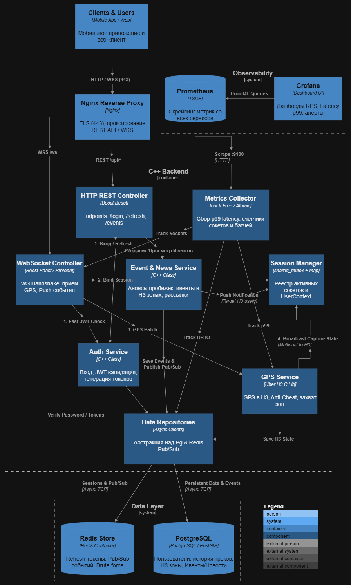

# Cистем дизайн

## Функциональные требования
1. Аутентификация и управление сессиями
    * Проверка логина/пароля и выдача пары токенов (Access JWT + Refresh Token). В PostgreSQL храним только хеши паролей
    * Управление Refresh-Token: хранение и ротация Refresh-токенов в Redis Store для реализации механизма выхода и защиты от Brute-force
    * восстановление связи: Поддержка повторного подключения при разрыве сети с быстрым перевыпуском WS-тикета
2. Прием и обработка геоданных
    * Потоковый прием координат: Прием бинарных Protobuf-сообщений со списками GPS-точек от мобильного клиента через WebSocket,
    * Привязка к H3-сетке: Конвертация сырых координат (Latitude/Longitude) в индексы гексагонов Uber H3 (uint64_t)
    * Валидация и защита от читерства (GPS Anti-Cheat) Проверка правдоподобности перемещений (скорость, телепортация, валидация временных меток) перед зачетом территории
    * Захват зон (Territory Capture): Расчет суммарного времени/расстояния в гексагоне и смена владельца территории
3. Ивенты и уведомления (Event & News Service)
    * Запланированные пробежки: cоздание и получение анонсов совместных пробежек, привязанных к конкретным H3-зонам.
    * Push-уведомления: Рассылка анонсов и сообщений активным WebSocket-пользователям, находящимся в целевых гексагонах.

## Нефункциональные требования
1. Безопасность
    * Шифрование трафика: Терминация TLS (HTTPS/WSS) на уровне Nginx Reverse Proxy (порт 443).
    * Защита от атак: Ограничение частоты запросов (Rate Limiting) и защита от Brute-force на уровне Nginx и Redis.
2. Надежность и масштабируемость
    * Stateless бэкенд.  Не должен хранить состояние сессий локально. При росте нагрузки новые инстансы C++ сервиса должны запускаться за Nginx без перенастройки других узлов
    * Graceful Shutdown: При перезапуске или обновлении C++ сервиса соединения должны закрываться с корректным кодом (1001 Going Away), позволяя клиентам переключиться на другой узел без потери несохранённых данных
    * Использование Redis Pub/Sub для синхронизации событий и состояния сессий между несколькими инстансами C++ сервиса
    * Персистентность данных: Надежное хранение пользователей, истории пробежек и долгосрочного состояния H3-зон в PostgreSQL/PostGIS, а кэша и временных данных — в Redis
3. Наблюдаемость и мониторинг
    * Сбор метрик: Потокобезопасная сборка метрик (Lock-Free / std::atomic) внутри Metrics Collector и экспорт по протоколу Prometheus (порт :9100).
    * Мониторинг (Prometheus + Grafana): Отслеживание задержек p99, количества активных WebSocket-сокетов, RPS и ошибок системы в режиме реального времени.
    * Централизованное логирование: Асинхронная отправка структурированных логов через stdout в Loki / Vector без блокировки основного потока обработки.
4. Производительность
    * Пропускная способность и емкость. Поддержка не менее 10 000 – 45 000 (уровень марафона в моем городе) одновременных активных WebSocket-соединений на один кластер бэкенда

